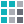
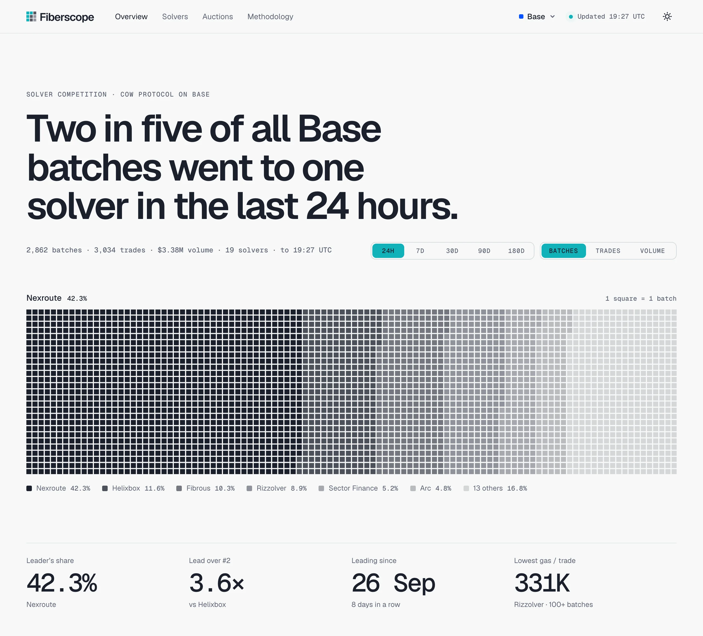
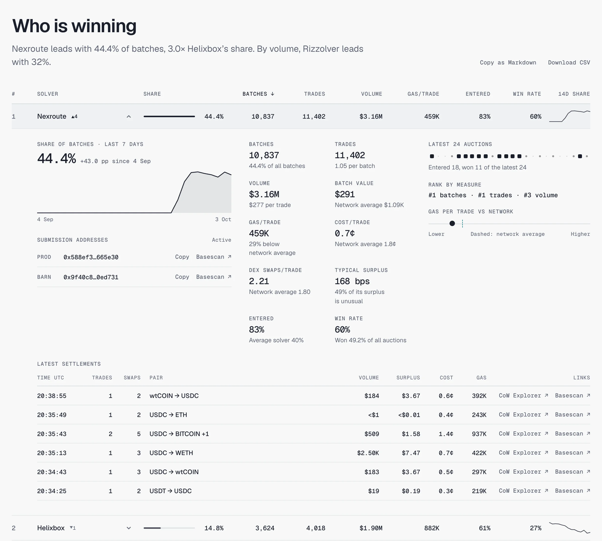
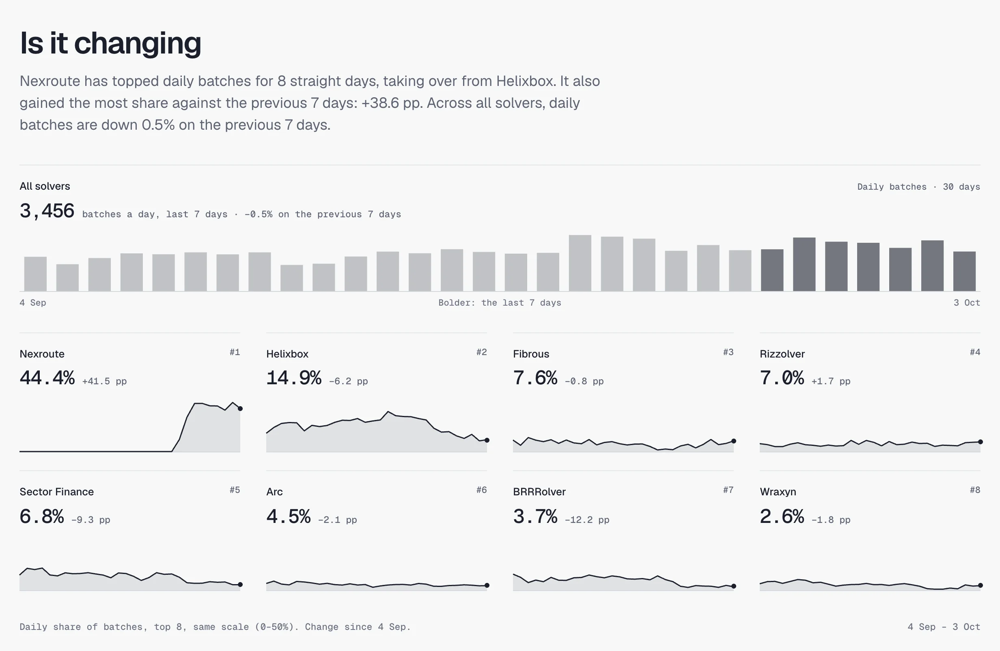
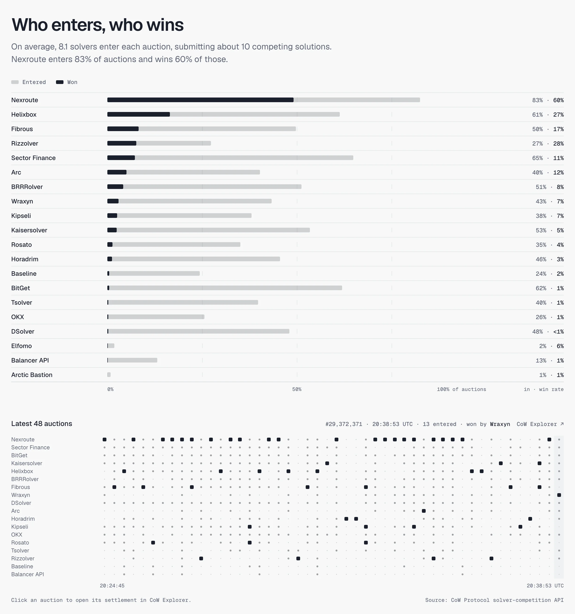
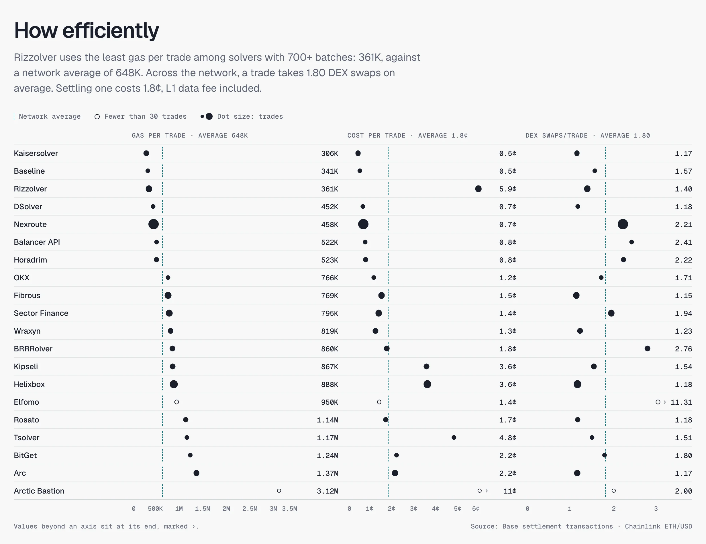
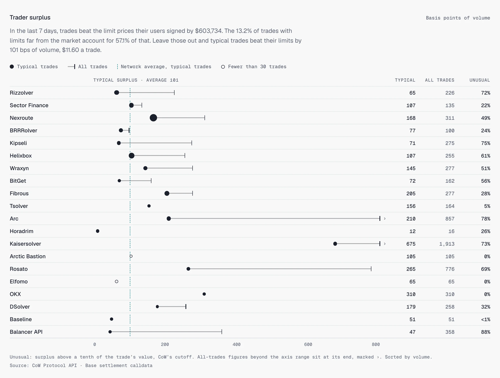
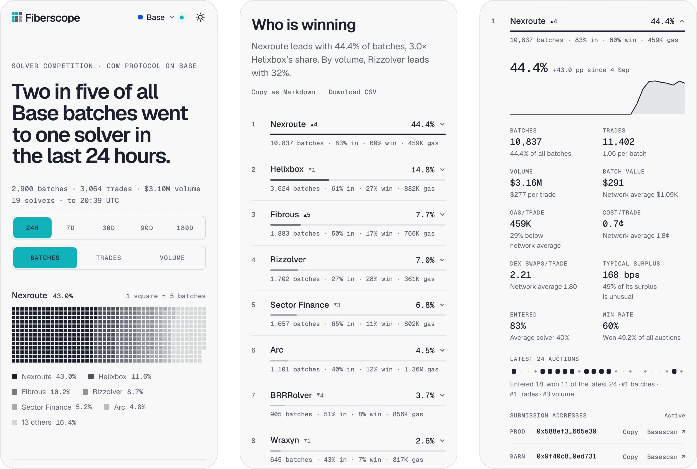
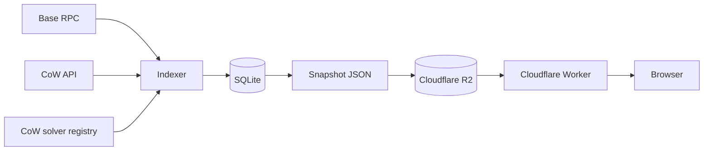

#  Fiberscope

Open-source analytics for [CoW Protocol](https://cow.fi) solvers on Base: who wins the batch
auctions, by how much, whether that is changing, and how efficiently each solver settles.

[](https://github.com/Fibrous-Finance/fiberscope/actions/workflows/ci.yml)
[](LICENSE)

<a href="https://fiberscope.kermo.workers.dev">
<picture>
<source media="(prefers-color-scheme: dark)" srcset="docs/images/hero-dark.webp">
<source media="(prefers-color-scheme: light)" srcset="docs/images/hero-light.webp">

</picture>
</a>

**Live at [fiberscope.kermo.workers.dev](https://fiberscope.kermo.workers.dev)**, updated every 10
minutes.

## What it shows

<table>
<tr>
<td width="50%" valign="top">

<p><b>Who is winning.</b> Each solver's share of batches, trades or volume over 24 hours, 7, 30, 90 or 180 days, with rank changes, entry and win rates. A row opens the solver's detail.</p>
</td>
<td width="50%" valign="top">

<p><b>Is it changing.</b> Daily totals across all solvers, the leading solvers' daily share, and how long the current leader has led.</p>
</td>
</tr>
<tr>
<td width="50%" valign="top">

<p><b>Who enters, who wins.</b> How often each solver enters an auction and how often it wins, and a tape of the latest 48 auctions: who entered each and who won it.</p>
</td>
<td width="50%" valign="top">

<p><b>How efficiently.</b> Gas, transaction cost and DEX swaps per trade for each solver, against the network average.</p>
</td>
</tr>
<tr>
<td width="50%" valign="top">

<p><b>Trader surplus.</b> How far trades beat the limit prices their users signed, in basis points of volume, with surplus from limits far from the market set apart.</p>
</td>
<td width="50%" valign="top">

<p><b>On a phone.</b> The same page in a compact layout.</p>
</td>
</tr>
</table>

Every view is a link (`?period=7d&measure=volume&solver=<id>`), the solver table copies as
Markdown or downloads as CSV, and the page's Methodology defines every figure.

## How it works



The indexer reads settlements, receipts, calldata and Chainlink's ETH/USD rate from Base, the
auction behind each settlement from CoW's API, and solver names from CoW's registry, into SQLite.
Every 10 minutes it catches up with the chain, writes a snapshot with every figure the page shows,
and uploads it to R2; then it backfills history until the next run is due. The site, Next.js on a
Cloudflare Worker, reads the snapshot from R2 and derives every window, share and rank from it.

## Accuracy

Over 30 days of Base blocks, batches, trades, DEX swaps and gas per trade agree with CoW's own Dune
dashboard to within about 0.1%. Over a week, every batch was credited to the solver that CoW's
competition data names as its winner, and the order terms behind surplus match CoW's order book.
The figures are in [Validation](docs/methodology.md#validation); every definition is in
[docs/methodology.md](docs/methodology.md).

## Run it locally

Requires Node 24 and pnpm 10.

```sh
pnpm install
cd apps/indexer
node src/cli.ts sync --chain-days 1 --auction-days 1 --snapshot ../web/data/snapshot.json
cd ../..
pnpm dev   # http://localhost:3000
```

The `sync` indexes the last day of Base, which takes about 20 minutes from scratch.
[docs/development.md](docs/development.md) covers longer histories, keeping the data live,
configuration, checks and deployment.

## Repository layout

| Path                | What it is                                                                                           |
| ------------------- | ---------------------------------------------------------------------------------------------------- |
| `apps/web`          | The site: Next.js 16, React 19, Tailwind CSS 4 and next-intl, on Cloudflare Workers through OpenNext |
| `apps/indexer`      | The indexer: Node 24 with no third-party dependencies, SQLite through `node:sqlite`; runs in Docker  |
| `packages/core`     | The snapshot contract and the view model (windows, shares, ranks), formatting and chart geometry     |
| `docs`              | [Methodology](docs/methodology.md), [development](docs/development.md) and these screenshots         |
| `.github/workflows` | CI checks, and deploys with a preview for each pull request                                          |

## Contributing

See [CONTRIBUTING.md](CONTRIBUTING.md). Report vulnerabilities privately, as
[SECURITY.md](SECURITY.md) describes.

## License

[MIT](LICENSE)

---

Fiberscope is an independent project, not affiliated with CoW DAO. It is built by
[Fibrous](https://fibrous.finance), which also runs a solver on CoW Protocol and is measured by the
same code as every other solver.
